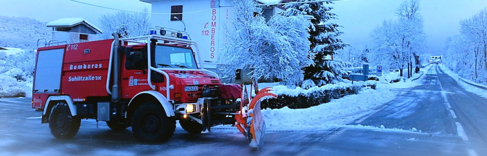
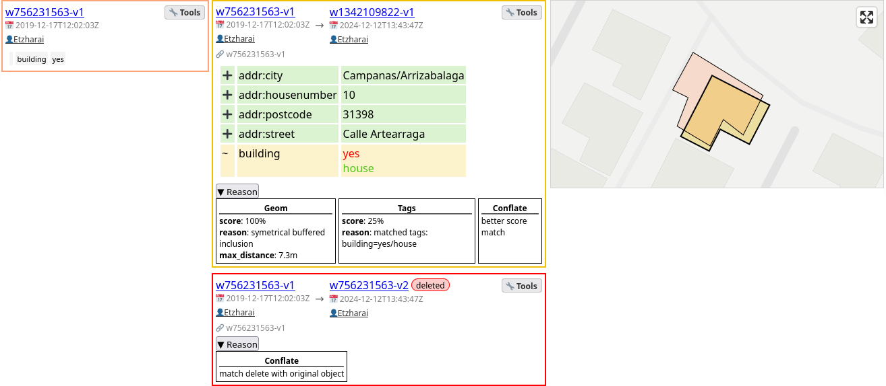
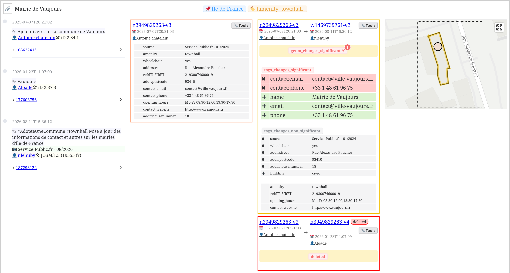

## Clearance: Quality Proxy for OSM Replication

## SotM 2026

Frédéric Rodrigo - Teritorio

frederic@teritorio.fr

---

## Context

- OSM Continuous update: add, update, improve, fix
- Quickly deploy changes
- ➡ But need Quality assurance

e.g. POIs (Local government), road network (Civil defense)

----

## Expectation

- Review potentially harmful changes
  - Focused on objects that matter
  - Minimize human review workload
    - Significant and comprehensive changes
- Deploy OSM changes fast
- Work on OSM data format, not GIS
  - Then reuse all the OSM ecosystem tools

---

# Check changes
# But where?

----

## Existing QA Process

Check for
- State Before Contributions
  - JOSM Validator
- State After Contributions
  - Keep Right, OSM Inspector, Osmose-QA*
- Changes After Contributions
  - OSMCha

----

Another Way

## Check Before Replication

----

## Fuzzy Update

Never know about incoming quality updates

➡ Filter incoming changes

----

### Replication
### But with QA Filter

- Import OSM Extract into Database
- Import incoming Diff into Database
  - Without applying
- Check update Quality
  - OK ⇒ Apply changes
  - Not OK ⇒ Hold on
    - Fix in OSM
    - Wait for the next OSM update to be OK

Invariant: Quality of Replication is only increasing

---

# Fast
# But coherant

----

### Do not hold

- at changeset level
- at replication diff level
  - aka point in time
- at OSM object level
  - aka only technical and contextless

----

### Hold at LoCha Level
##### Spatially clustered changes

Spatially coherent changes set

- Hold on locally
- Let other changes pass
  - ⇒ deploy updates quickly

----

### Hierarchical structure of LoCha

- LoCha: cluster within distance – semantic context
  - Connected component: topological connection – referential integrity
    - Semantic group: subpart of the same business object
      - OSM Object: technical

---

# Logical History
### Semantic Spatio-temporal conflation

----

## Validation Context

- Validate only what matters
  - in specified spatial area
  - by OSM tags selection
  - on a subset of secondary tags
- Validate using tags, geometry, metadata, changeset...
- Validate on time-conflated semantic objects
  - do not use OSM id

----

## Time-conflated Semantic Objects

Apply rules on Semantic and Comprehensive changes

- Conflation between
  - last synchronized object versions
  - and held incoming version

----

## Time-conflated Semantic Objects
As a Tool: OSM Local History - [Github](https://teritorio.github.io/openstreetmap-logical-history-component/) -
[Demo](https://teritorio.github.io/openstreetmap-logical-history-component/?date_start=2024-12-09T23:00:00.000Z&date_end=2024-12-14T23:00:00.000Z&bbox=-1.6537454710167148,42.685107065011486,-1.6509720668953156,42.68686379572838#locha-demo-group-33)

---

# Rules

----

## Available Rules

By semantic conflation match

- Geometry moved > 10 m
- Blacklisted tags or users
- Changes by a new contributor
- Commented changeset
- Hold on “hot” changes:
  - area still being updated
  - objects quickly fixed or reverted by the OSM community
- Explicitly required manual review (e.g. change on defibrillator)

----

## Available Rules

By LoCha

- Network continuity break
  - road, railway, power grid...
- Should not create duplicate POIs

----

## Next Rules

New validators, funded by NLNet
* Fetch user blocks and use them in score
* Contributors' reputation: based on external tools / APIs

----

## Roadmap: Rules

New validators
- Reformatted tag values: e.g. `phone`
- Alternative tagging schemas
  - `highway=path` + `bicycle=designated` ⇄ `highway=cycleway`
- External Rules
  - Like MapCSS from JOSM or Osmose-QA validation
- Match at External Datasets
  - Conflation by ref or geometry
  - Geometry acceptability
  - Tags acceptability

----

## Roadmap: Rules

Improvement
* Delayed: function of parameters (user score, etc.)
* Network: subclass it
  * Road network with oriented edges, road barriers
  * Power grid

---

# Roadmap: Optimization

----

### Optimization: too much data

Store, process and update many OSM extracts

Small areas projects
- Campuses...
- ➡ Use alternative sources:
  - Overpass API, GeoDesk/GOL/Parquet or ohsome-planet/Parquet.

Sparse objects, in a full country
- bicycle routes
- emergency POIs
- ➡ Use a partial database:
  - require **augmented diff** or a way to _rescue_ missing referenced objects

----

### Optimization: too big objects

Big objects and Big LoCha clusters

- Country boundaries, big multipolygon landuses...
- Large network and relations
  - route and route relations, power grid...

➡ Hard to keep LoCha _local_

Need for better splitting strategy.

----

### Optimization: too much computation

- Stop update process on nothing to update
- Time-conflating using sparse matrix

### <s>Optimization</s>: more computation

Replace greedy conflation with a least squares matching resolution

---

# Clearance

----

## Clearance
## as OSM Data Proxy

Standard Input / Output
- OSM PBF Extract
- Diff update
  - according to validation order

Acts as an Overpass-like API to access validated DB
- [Overpass Language parser in Rust](https://github.com/teritorio/overpass_parser_rust)
- [Overpass conversion to SQL query](https://github.com/teritorio/Underpass-API)

----

## Clearance

- Demo [app.clearance.teritorio.xyz](https://app.clearance.teritorio.xyz/france_ile_de_france_poi/changes_logs?filterBySelectors=[amenity=townhall]&filterByAction=geom_changes_significant#locha--1970824353-group-0)
- https://github.com/teritorio/clearance

----

## Clearance

OSM Extracts sync only with qualified changes

Setup your own Instance or

ask for a demo project on our public instance

- https://app.clearance.teritorio.xyz
- https://teritorio.github.io/openstreetmap-logical-history-component/

----

## Clearance

`takeaway=slides`

https://s.carto.guide/djamig

